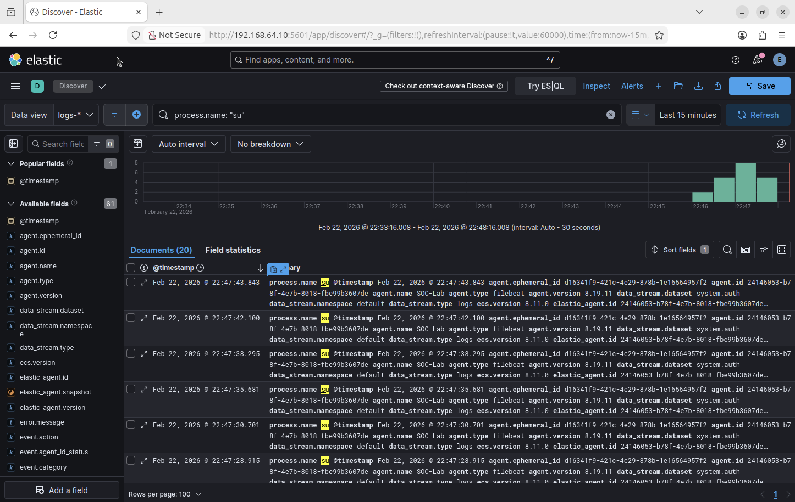
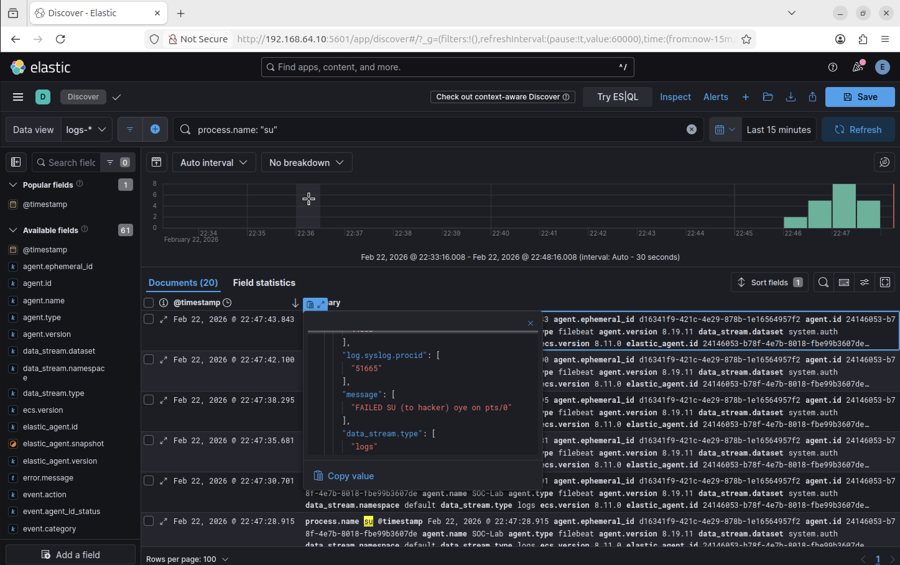
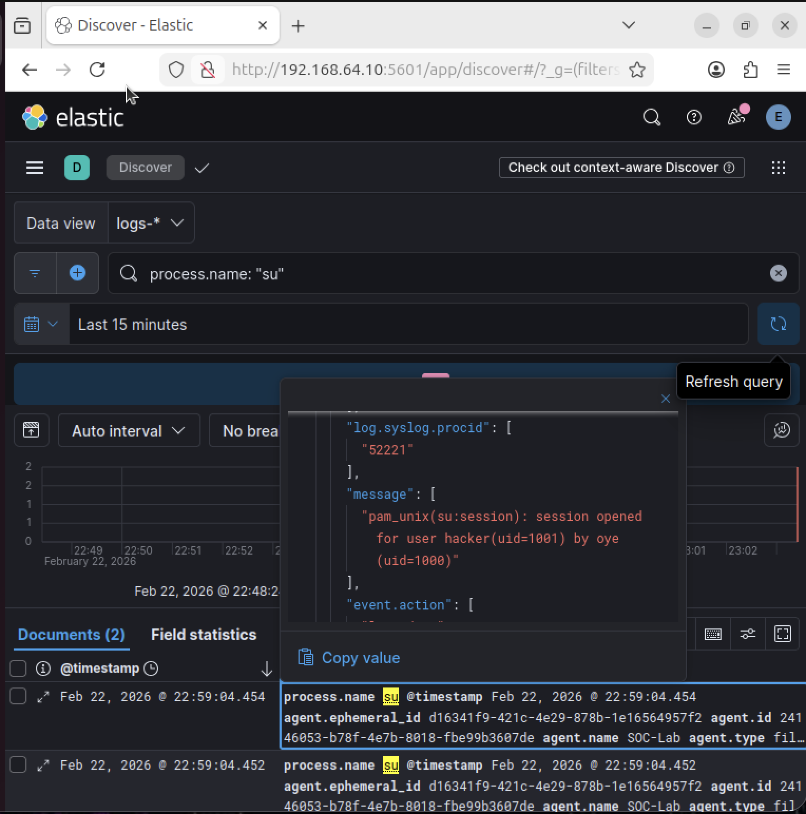

# Incident 01 — Brute Force Detection

## Summary
Multiple failed authentication attempts were detected targeting the user **hacker** within a short time window, indicating a potential brute-force attack.

## Evidence
Elastic SIEM logs showed repeated:

- event.dataset: system.auth  
- process.name: su  
- event.outcome: failure  

More than **10 failures within ~30 seconds** were observed.

## Analysis
This behavior is not consistent with normal human login activity and suggests automated password-guessing.

## Severity
**High**

Because:
- Repeated authentication failures
- Targeting a privileged or local account
- Potential for privilege escalation if successful

## Containment Action
The compromised or targeted account should be:

- **Locked or disabled immediately**
- Source IP investigated and blocked if malicious
- System monitored for persistence attempts

## Lessons Learned
Centralized logging in Elastic SIEM enabled rapid detection of brute-force behavior and supports incident response investigation.

## Investigation Evidence

### Brute Force Login Attempts Detected
The timeline below shows repeated failed `su` authentication attempts targeting the **hacker** account.

### Example Failed Authentication Event
This log entry shows a failed attempt to switch user to `hacker`.

### Successful Authentication Event
This log confirms a successful session was eventually opened for the user `hacker`.

