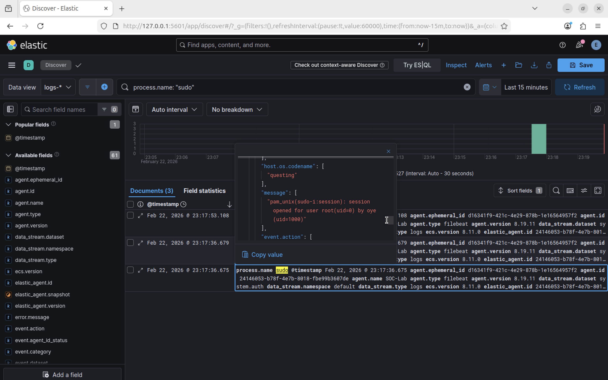
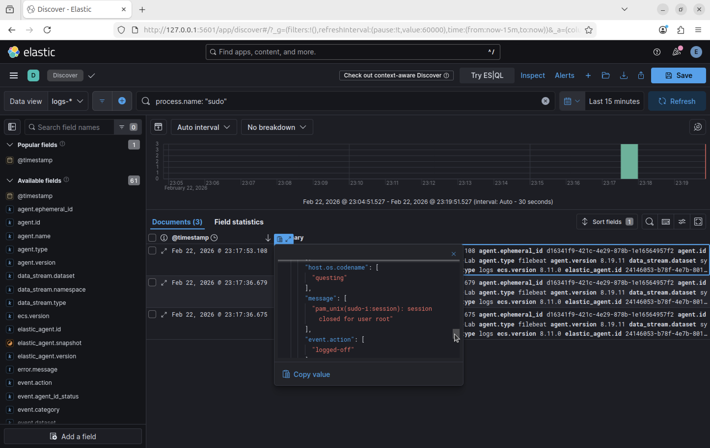
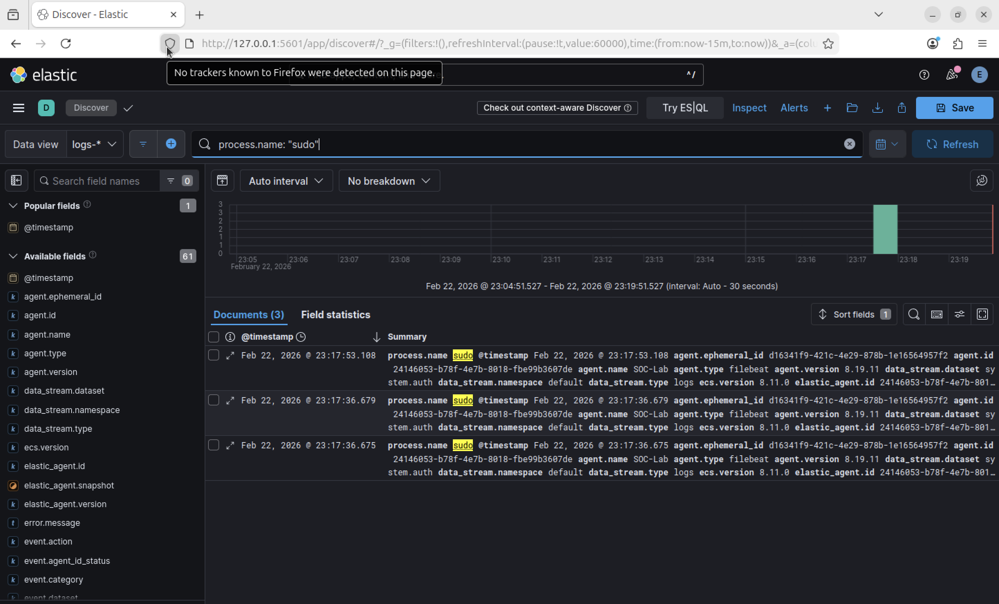

# Incident 02 — Privilege Escalation Detection

## Summary
A privileged command execution was detected in Elastic SIEM logs where the user `oye` initiated a `sudo` session, resulting in a root shell.

This activity represents a **privilege escalation event**, where a standard user temporarily obtained root-level access.

---

## Detection Query

The following KQL query was used to identify sudo activity in Elastic SIEM:

```kql
process.name: "sudo"
```

---

## Evidence

Elastic SIEM logs captured the following events:

1. Root session opened using `sudo`
2. Root session closed
3. `sudo` activity visible in the log timeline

---

### Root Session Opened

The following log shows a privileged root session being opened through `sudo`.



---

### Root Session Closed

This log confirms the root session was later terminated.



---

### Sudo Activity Timeline

The timeline below shows `sudo` activity recorded in Elastic SIEM.



---

## Analysis

The logs confirm that the user `oye` executed a sudo command that opened a root session. This behavior is expected for administrative activity but must be monitored as it represents privileged system access.

Monitoring sudo usage helps detect potential privilege escalation attempts by attackers.

---

## Severity

Medium

Because:

- Root privileges were granted
- Administrative access could be abused if credentials are compromised

---

## Lessons Learned

Elastic SIEM centralized logging makes it possible to detect and investigate privilege escalation events quickly by monitoring authentication and sudo activity across systems.
