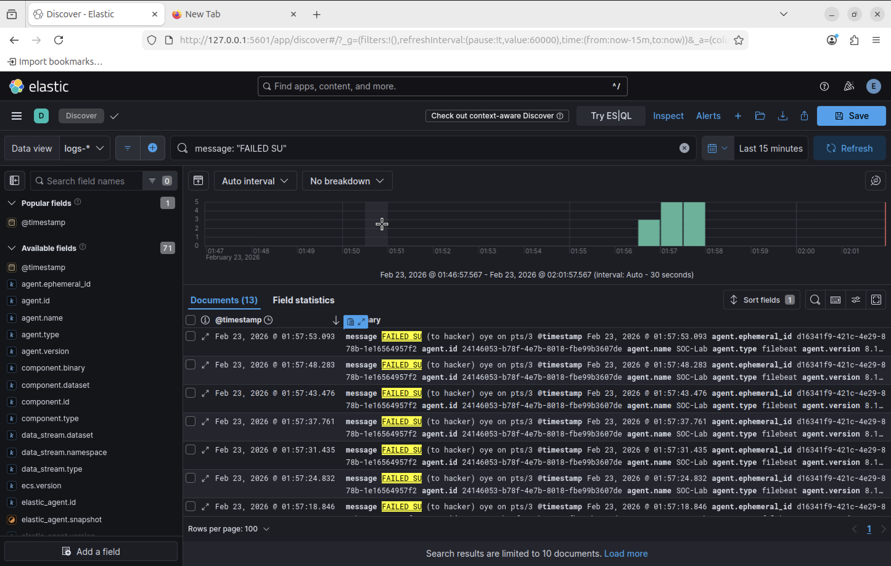
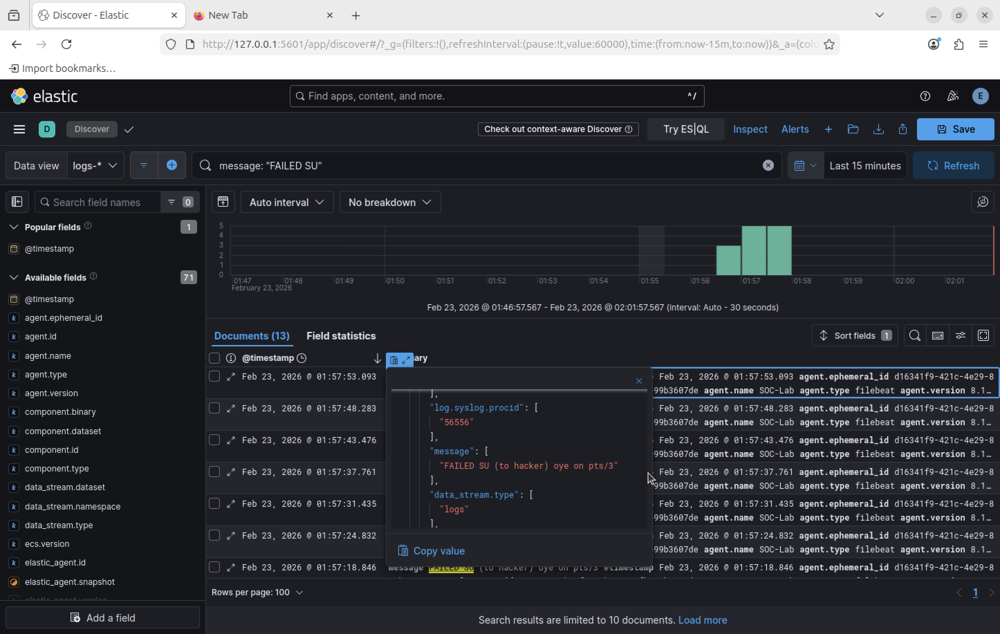

# Incident 03 — SU Brute Force Authentication Attempt

## Summary
Multiple failed `su` authentication attempts were detected targeting the user **hacker** within a short timeframe. This pattern indicates a potential brute-force password attack.

## Detection Method
Elastic SIEM logs were queried using:

message: "FAILED SU"

The results showed repeated authentication failures.

## Evidence

### Brute Force Timeline

### Failed Authentication Event

## Analysis
Repeated `su` failures within seconds indicate automated or repeated password guessing behavior.

## Severity
Medium

Repeated authentication failures could lead to account compromise if successful.

## Recommended Response

- Investigate the user account activity
- Monitor further authentication attempts
- Implement account lockout policies if necessary
