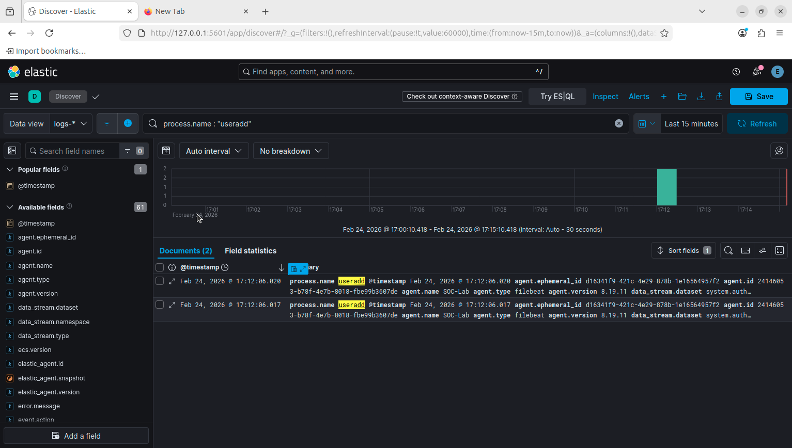
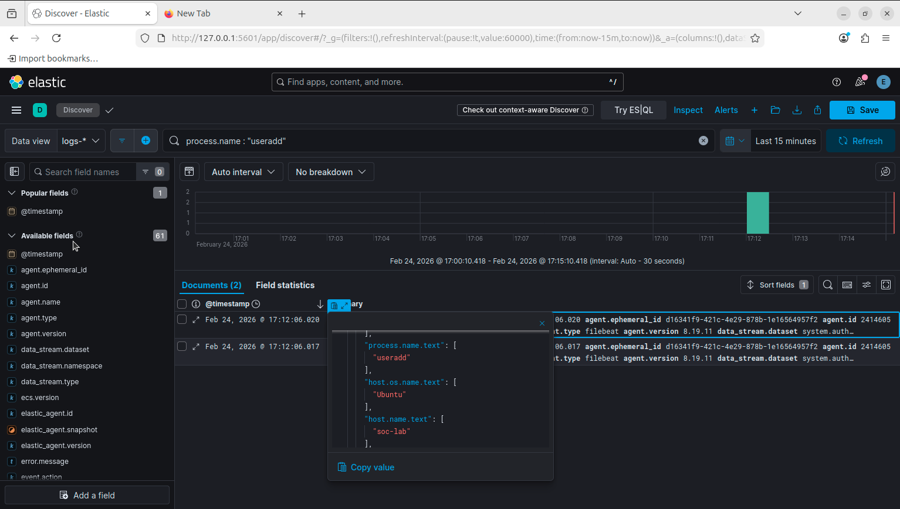

# Incident 04 — Unauthorized User Creation

## Summary
A new user account named `attacker` was created on the system using the `useradd` command. Unauthorized user creation can indicate persistence activity following a system compromise.

## Detection Query
process.name : "useradd"
## Evidence

### User Creation Event

### Log Details

## Analysis
Elastic SIEM detected execution of the `useradd` command on the SOC-Lab system. This command created a new user account on the host.

Creation of unauthorized user accounts is a common persistence technique used by attackers to maintain access to a compromised system.

## Severity
Medium

## Recommended Response
Monitor account creation activity and investigate any unexpected user additions on critical systems.
